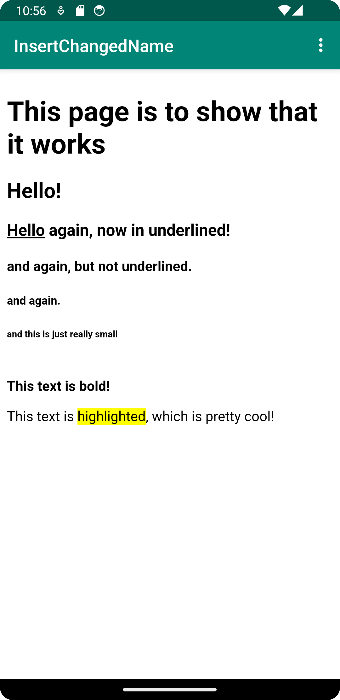
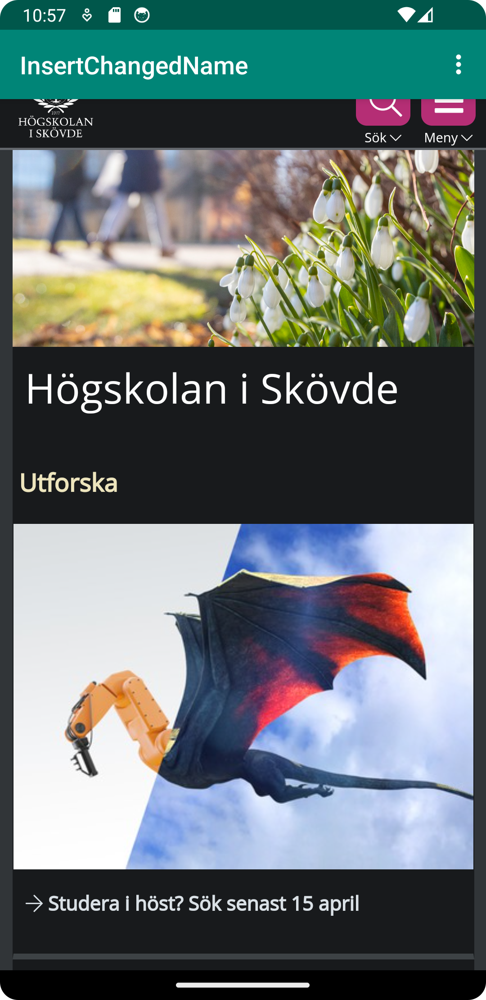

Ändrade namn på appen via 
```
<string name="app_name">InsertChangedName</string>
```
som befinner sig i strings.xml.

möjliggjorde internet-access, genom att lägga till kodraden
```
 <uses-permission android:name="android.permission.INTERNET"/>
```
i AdroidManifest.xml

Programkod ska se ut som exemplet nedan. Koden måste vara korrekt indenterad då den 
blir lättare att läsa vilket gör det lättare att hitta syntaktiska fel.

Lade till en WebView via kodraden nedan, samt ändrade id till myWebView
```
<WebView
android:id="@+id/myWebView"
android:layout_width="match_parent"
android:layout_height="match_parent"
/>
```
Jag deklarerade classen WebView sedan används för att skapa ett WebView objekt. Denna används för att
exempelvis sätta vilken Url som kommer laddas på WebViewn, samt vilken webView som ska användas.

```
setContentView(R.layout.activity_main);
myWebView = findViewById(R.id.my_WebView);
myWebView.setWebViewClient(new WebViewClient()); // Do not open in Chrome!
myWebView.loadUrl("https://his.se");
WebView myWebView;
```
Med använding av gettern samt settern för webSettings sätter vi in värdet (true) för att möjlighetsgöra använding av JavaScript.
```
WebView myWebView = (WebView) findViewById(R.id.my_WebView);
WebSettings webSettings = myWebView.getSettings();
webSettings.setJavaScriptEnabled(true);
```
Med handledning löstes problem med ToolBar som tappat sin text, genom att ta bort en kodrad som satte en ny contentView,
på en existerande ContentView. se nedan.
```
//setContentView(R.layout.activity_main);
```
Via onOptionsItemSelected(), satte jag in metoderna showExternalWebPage(), samt showInternalWebPage() till dess korreponderande
if-sats, vilket gör att dessa nu kommer öppnas beroende på den valda "knappen" i dropdown-menyn. Jag fixade även så att
rätt intern-webbsida kommer upp vid val av internal website.
```
myWebView.loadUrl("file:///android_asset/about.html");
```

För att möjliggöra en intern webbsida, skapade jag en ny asset folder, assets. I denna skapade jag en directory, img, och en fil, about.html.
Denna filen används sedan som den interna webbsidan. För att se så att allting fungerar, lade jag till text i filen. Ex:
```
<h1>This page is to show that it works</h1>
<h2> Hello! </h2>
```
The internal website:


The external website:
